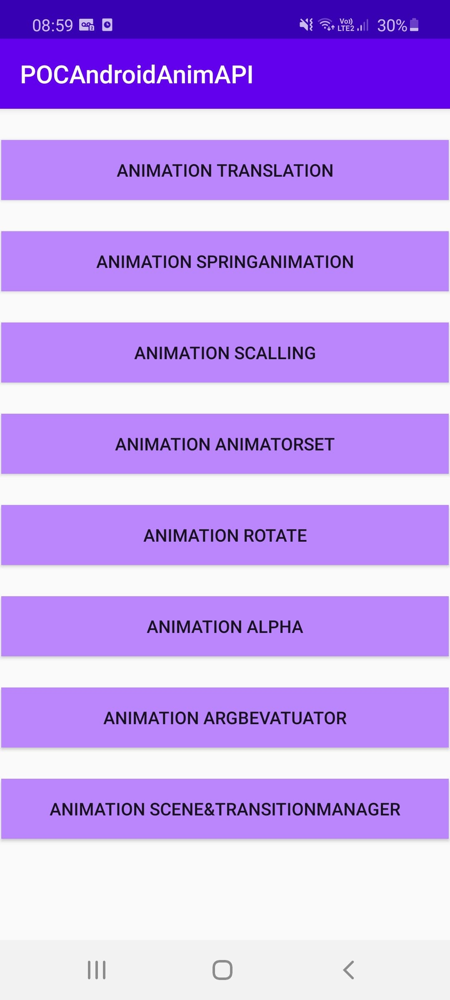
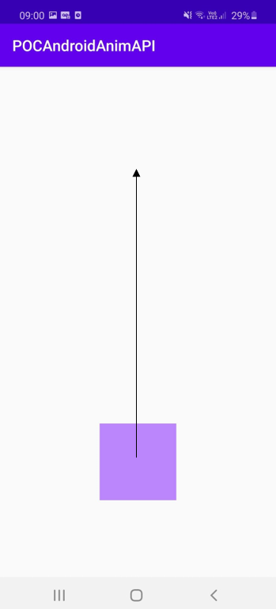

# POC Animation Android

Dans ce projet j'explore plusieurs API d'animations.

## Home Page



##Translation



Cette animation va animer notre objet de 1000dp vers le haut avec une durée de 2000ms
Pour cela il existe plusieurs méthode.

Méthode 1 (API AnimationsUtils):

Pour cela on définit l'animation dans un fichier xml
```xml
<?xml version="1.0" encoding="utf-8"?>
<set xmlns:android="http://schemas.android.com/apk/res/android">
    <translate
        android:fromXDelta="0"
        android:toXDelta="0"
        android:fromYDelta="0"
        android:toYDelta="-1000"
        android:duration="2000" />
</set>
```

Puis on appel cette animation dans notre activity
```kotlin
viewTranslation.startAnimation(AnimationUtils.loadAnimation(this,R.anim.translation))
```

Méthode 2 (API ObjectAnimator):
```kotlin
ObjectAnimator.ofFloat(viewTranslation, "translationY", -1000f).setDuration(2000).start()
```


## Configuration
### Keystores:
Create `app/keystore.gradle` with the following info:
```gradle
ext.key_alias='...'
ext.key_password='...'
ext.store_password='...'
```
And place both keystores under `app/keystores/` directory:
- `playstore.keystore`
- `stage.keystore`


## Build variants
Use the Android Studio *Build Variants* button to choose between **production** and **staging** flavors combined with debug and release build types


## Generating signed APK
From Android Studio:
1. ***Build*** menu
2. ***Generate Signed APK...***
3. Fill in the keystore information *(you only need to do this once manually and then let Android Studio remember it)*

## Maintainers
This project is mantained by:
* [Federico Ramundo](http://github.com/framundo)


## Contributing

1. Fork it
2. Create your feature branch (git checkout -b my-new-feature)
3. Commit your changes (git commit -m 'Add some feature')
4. Run the linter (ruby lint.rb').
5. Push your branch (git push origin my-new-feature)
6. Create a new Pull Request
