# POC Animation Android

Dans ce projet j'explore plusieurs API d'animations.

## Home Page


## Translation


Cette animation va animer notre objet de 1000dp vers le haut avec une durée de 2000ms.
Pour cela il existe plusieurs méthode.

### Méthode 1 (API AnimationsUtils):

On définit l'animation dans un fichier xml
```xml
<?xml version="1.0" encoding="utf-8"?>
<set xmlns:android="http://schemas.android.com/apk/res/android">
    <translate
        android:fromXDelta="0"
        android:toXDelta="0"
        android:fromYDelta="0"
        android:toYDelta="-1000"
        android:duration="2000" />
</set>
```

Puis on appel cette animation dans notre activity
```kotlin
viewTranslation.startAnimation(AnimationUtils.loadAnimation(this,R.anim.translation))
```

### Méthode 2 (API ObjectAnimator):
```kotlin
ObjectAnimator.ofFloat(viewTranslation, "translationY", -1000f).setDuration(2000).start()
```

## SpringAnimation

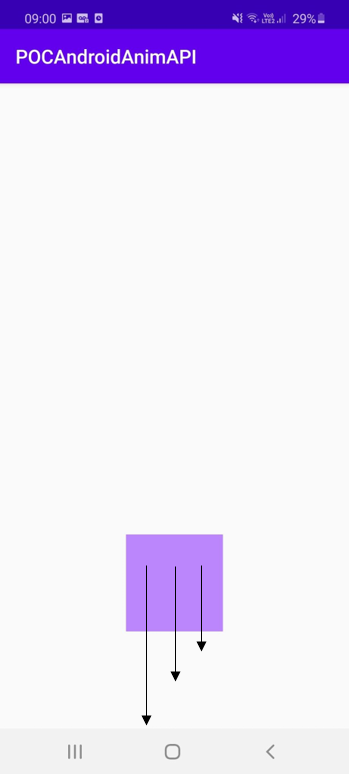

Cette animation va faire faire 3 petits rebond à notre objet.

Pour cela ajoutez tout d'abord cette librairie dans vos dépendances gradle:
```gradle
dependencies {
    def dynamicanimation_version = '1.0.0'
    implementation "androidx.dynamicanimation:dynamicanimation:$dynamicanimation_version"
}
```

Le code suivant vous permettra d'animer votre objet (Remarque: en faisant varier les paramètres velocity, stiffness et damping ratio il est possible de calibrer le rebond de l'objet comme bon nous semble)
```kotlin
val springAnim = findViewById<View>(R.id.viewSpringAnimation).let { img ->
    val springAnim = findViewById<View>(R.id.viewSpringAnimation).let { img ->
        SpringAnimation(img, DynamicAnimation.TRANSLATION_Y, 0f).apply {
            setStartVelocity(2500.0F)
            spring.stiffness = SpringForce.STIFFNESS_VERY_LOW
            spring.dampingRatio = SpringForce.DAMPING_RATIO_HIGH_BOUNCY
        }
    }
    springAnim.start()
```

## Scalling

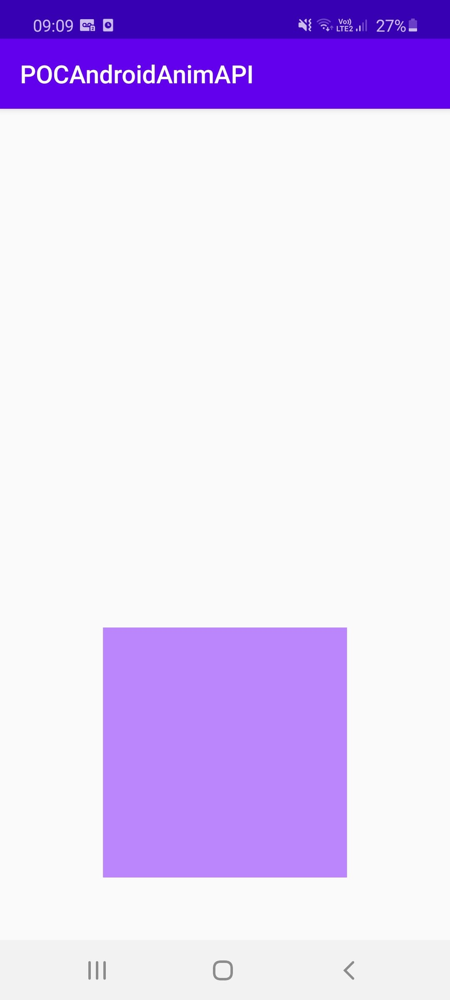

Cette animation va permettre de doubler la taille de notre objet. Comme pour la translation j'ai défini l'animation dans un fichier xml
```xml
<?xml version="1.0" encoding="utf-8"?>
<set xmlns:android="http://schemas.android.com/apk/res/android">
    <scale
        android:fromXScale="1"
        android:toXScale="2"
        android:fromYScale="1"
        android:toYScale="2"
        android:duration="2000"
        android:pivotX="50%"
        android:pivotY="50%"/>
</set>
```

Puis j'applique l'animation à mon objet grace l'API AnimationUtils
```kotlin
viewScalling.startAnimation(AnimationUtils.loadAnimation(this,R.anim.scalling))
```

## AnimatorSet


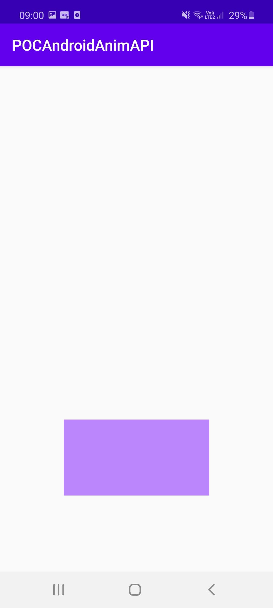

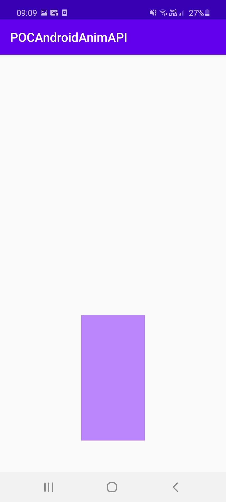


Grâce l'API AnimatorSet nous allons pouvoir définir un enchainement d'animation dans un ordre prédéfini
```kotlin
val scaleDownX = ObjectAnimator.ofFloat(viewAnimatorSet, "scaleX", 1f)
val scaleDownY = ObjectAnimator.ofFloat(viewAnimatorSet, "scaleY", 1f)
val scaleUpX = ObjectAnimator.ofFloat(viewAnimatorSet, "scaleX", 2f)
val scaleUpY = ObjectAnimator.ofFloat(viewAnimatorSet, "scaleY", 2f)
scaleDownX.duration = 2000
scaleDownY.duration = 2000
scaleUpX.duration = 2000
scaleUpY.duration = 2000

AnimatorSet().apply {
    play(scaleUpX).before(scaleUpY)
    play(scaleDownX).after(scaleUpY)
    play(scaleDownY).after(scaleDownX)
    start()
}
```

## Rotate

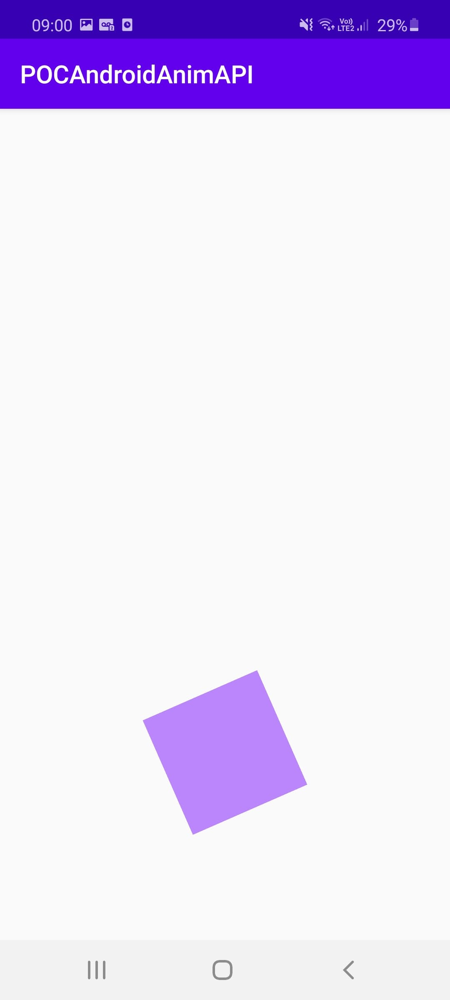

Cette animation va nous permettre de faire faire une rotation à notre objet. Pour cela encore une fois 2 méthodes

# Méthode 1 (API AnimationsUtils):

On définit l'animation dans un fichier xml
```xml
<?xml version="1.0" encoding="utf-8"?>
<set xmlns:android="http://schemas.android.com/apk/res/android">
<rotate
    android:pivotX="50%"
    android:pivotY="50%"
    android:repeatCount="0"
    android:fromDegrees="0"
    android:toDegrees="360"
    android:duration="2000" />
</set>
```

Puis on appel cette animation dans notre activity
```kotlin
viewRotate.startAnimation(AnimationUtils.loadAnimation(this,R.anim.rotate))
```

# Méthode 2 (API ObjectAnimator):
```kotlin
ObjectAnimator.ofFloat(viewRotate, "rotation", 0f, 360f).setDuration(2000).start()
```

## Alpha

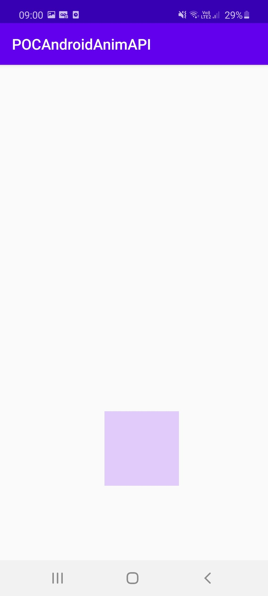

Cette animation va nous permettre de faire disparaitre notre objet en modifiant son opacité

On définit l'animation dans un fichier xml
```xml
<?xml version="1.0" encoding="utf-8"?>
<set xmlns:android="http://schemas.android.com/apk/res/android">
    <alpha
        android:fromAlpha="1"
        android:toAlpha="0"
        android:duration="2000"/>
</set>
```

Puis on appelle cette animation dans notre activity
```kotlin
viewAlpha.startAnimation(AnimationUtils.loadAnimation(this,R.anim.alpha))
```

Remarque: Il est probablement possible d'effectuer cette animation avec l'API ObjectAnimator

## ArgbEvaluator

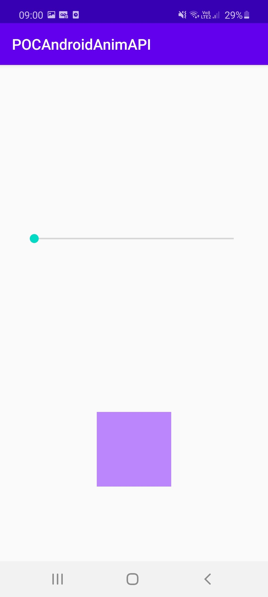
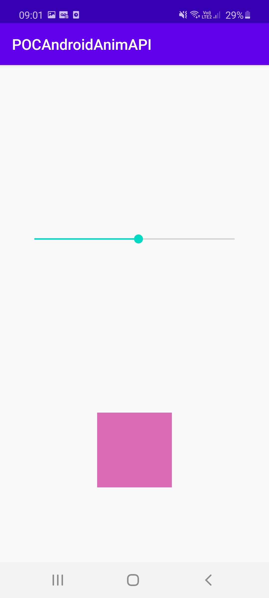
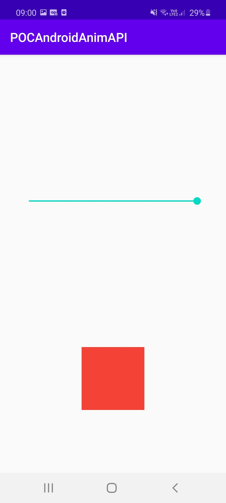

L'API ArgbEvaluator va permettre l'interpolation entre deux couleurs
```kotlin
class ActivityArgbEvaluator : AppCompatActivity() {
    override fun onCreate(savedInstanceState: Bundle?) {
        super.onCreate(savedInstanceState)
        setContentView(R.layout.activity_argb_evaluator)

        seekBarColor.setOnSeekBarChangeListener(object: SeekBar.OnSeekBarChangeListener{
            override fun onProgressChanged(seekBar: SeekBar?, progress: Int, fromUser: Boolean) {
                changeColor()
            }
            override fun onStartTrackingTouch(seekBar: SeekBar?) {}
            override fun onStopTrackingTouch(seekBar: SeekBar?) {}
        })
    }

    fun changeColor() {
        val color = ArgbEvaluator().evaluate(
            seekBarColor.progress.toFloat() / seekBarColor.max,
            ContextCompat.getColor(this,R.color.violet),
            ContextCompat.getColor(this,R.color.orange)
        ) as Int
        viewArgbEvaluator.setBackgroundColor(color)
    }
}
```

## Scene&TransitionManager

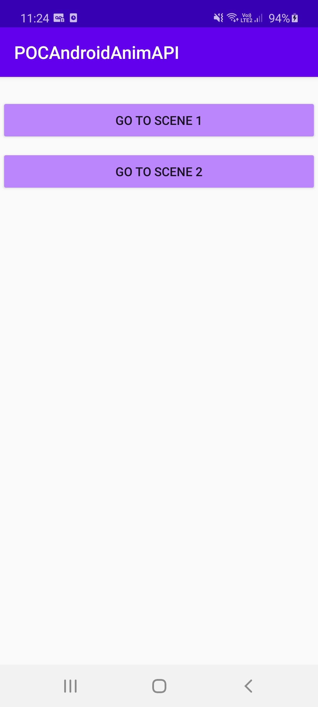
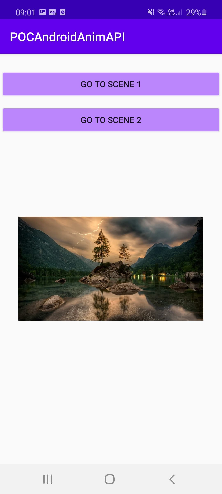
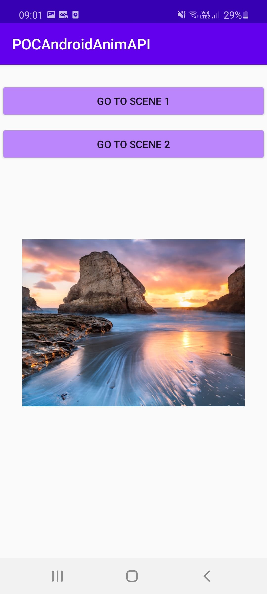

L'API transition manager va nous permettre de switcher entre plusieurs scenes.
Dans notre fichier xml définissant la vue de notre activity, on inclu une FrameLayout ayant pour id scene_root.
C'est ici que seront affichées nos scenes, chacune décrite dans un fichier xml.
```xml
<?xml version="1.0" encoding="utf-8"?>
<androidx.constraintlayout.widget.ConstraintLayout xmlns:android="http://schemas.android.com/apk/res/android"
    xmlns:app="http://schemas.android.com/apk/res-auto"
    xmlns:tools="http://schemas.android.com/tools"
    android:layout_width="match_parent"
    android:layout_height="match_parent"
    tools:context=".ActivitySceneTransitionManager">

    <Button
        android:id="@+id/goScene1"
        android:layout_width="0dp"
        android:layout_height="wrap_content"
        android:layout_marginStart="1dp"
        android:layout_marginTop="25dp"
        android:layout_marginEnd="1dp"
        android:backgroundTint="@color/violet"
        android:onClick="scene1TransitionManager"
        android:text="@string/go_to_scene_1"
        app:layout_constraintEnd_toEndOf="parent"
        app:layout_constraintHorizontal_bias="0.0"
        app:layout_constraintStart_toStartOf="parent"
        app:layout_constraintTop_toTopOf="parent" />

    <Button
        android:id="@+id/goScene2"
        android:layout_width="0dp"
        android:layout_height="wrap_content"
        android:layout_marginStart="1dp"
        android:layout_marginTop="10dp"
        android:layout_marginEnd="1dp"
        android:backgroundTint="@color/violet"
        android:onClick="scene2TransitionManager"
        android:text="@string/go_to_scene_2"
        app:layout_constraintEnd_toEndOf="parent"
        app:layout_constraintHorizontal_bias="0.0"
        app:layout_constraintStart_toStartOf="parent"
        app:layout_constraintTop_toBottomOf="@+id/goScene1" />

    <FrameLayout
        android:id="@+id/scene_root"
        android:layout_width="wrap_content"
        android:layout_height="wrap_content"
        app:layout_constraintBottom_toBottomOf="parent"
        app:layout_constraintEnd_toEndOf="parent"
        app:layout_constraintHorizontal_bias="0.5"
        app:layout_constraintStart_toStartOf="parent"
        app:layout_constraintTop_toBottomOf="@+id/goScene2">
    </FrameLayout>

</androidx.constraintlayout.widget.ConstraintLayout>
```

Puis dans notre Activity grâce à TransitionManager on appelle la scene1 ou 2 lorsque l'on click sur un bouton.
```kotlin
class ActivitySceneTransitionManager : AppCompatActivity() {

    lateinit var sceneRoot: ViewGroup
    lateinit var scene1: Scene
    lateinit var scene2: Scene

    override fun onCreate(savedInstanceState: Bundle?) {
        super.onCreate(savedInstanceState)
        setContentView(R.layout.activity_scene_transition_manager)

        sceneRoot = findViewById(R.id.scene_root)
        scene1 = Scene.getSceneForLayout(sceneRoot, R.layout.scene1, this)
        scene2 = Scene.getSceneForLayout(sceneRoot, R.layout.scene2, this)
    }

    fun scene1TransitionManager(view: View) {
        TransitionManager.go(scene1)
    }

    fun scene2TransitionManager(view: View) {
        TransitionManager.go(scene2)
    }
}
```

